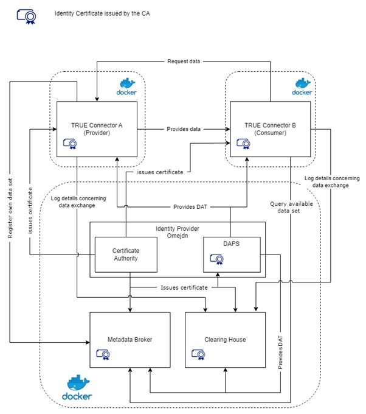

  

<!--the list of used link is at the bottom of the file-->

# Minimum Viable Data Space (MVDS) for Clarus Project
This repository will provide a deployment scenario of a Minimum Viable Data Space ([MVDS]([3])), defined using the International Data Spaces Assosiation ([IDSA]([4])) specification, as a solution for data exchange on the CLARUS project.
The open source TRUsted Engineering Connector ([TRUE Connector]([5])), developed by the Engineering group, will be used among the IDS components chosen to implement this solution.
The installation and configuration on which this paper will be based will refer to the guidelines defined on the [IDS testbed]([6]).
The project is currently in an early state of development, therefore, more information will be included as development progresses.

## Table of contents
* [**Architecture**](#architecture)
* [**Current Version**](#current-version)
* [**Development Stage**](#development-stage)
* [**Requirements**](#requirements)
* [**Setup**](#setup)
* [**Important Notes**](#important-notes)
* [**Troubleshoot**](#troubleshoot)
* [**Support Team**](#support-team)
<!--* [**License**](#license)-->
<!--* [**Endpoints**](#endpoints)-->

## Architecture

## Current Version

Status: _in development stage_

## Development Stage

Status: _Work in Progress_

## Requirements

### Hardware Requirements

|  Name   |           Value           |
| :-----: | :-----------------------: |
|   RAM   | 4GB (8GB is reccomended)  |
| Storage |           50GB            |

It is recommended to use 64bit quad core processor to provide enough processing power for all docker containers. 

### Software Requirements

|      Name      |      Version     |          Notes        |
| :------------: | :--------------: | :-------------------: |
|     Docker     |    20.10.7       | [Docker]([7])         |
| Docker-compose |     1.27.4       | [Docker-compose]([7]) |
|     Java       |       11         | [Java]([8])           |
|     Maven      |      3.6.3       | [Maven]([9])          |
|     Ruby       |      2.7.0       | [Ruby]([10])          |
|    Python      |        3         | [Python]([11])        |
<!--|     Ubuntu     |   20.04.1 LTS    |--> 

## Setup

TODO...

<!--## Endpoints-->

## Important Notes

TODO...

## Troubleshoot

TODO...

## Support Team

| Name                    |        E-mail         |
| :---------------------- | :-------------------: |
| [Luigi Di Corrado]([luigi]) | luigi.dicorrado@eng.it|
| [Luca Di Lorenzo]([2])  | luca.dilorenzo@eng.it |

<!--
## License
-->

<!--LIST OF LINKS USED-->

[luigi]: https://github.com/luidicorra

[2]: https://github.com/ludilorenz

[3]: https://github.com/International-Data-Spaces-Association/IDS-testbed/blob/master/minimum-viable-data-space/MVDS.md

[4]: https://internationaldataspaces.org/

[5]: https://github.com/Engineering-Research-and-Development/true-connector

[6]: https://github.com/International-Data-Spaces-Association/IDS-testbed/blob/master/InstallationGuide.md

[7]: https://docs.docker.com/

[8]: https://docs.oracle.com/en/java/javase/11/ 

[9]: https://maven.apache.org/guides/index.html

[10]: https://ruby-doc.org/

[11]: https://docs.python.org/3/

